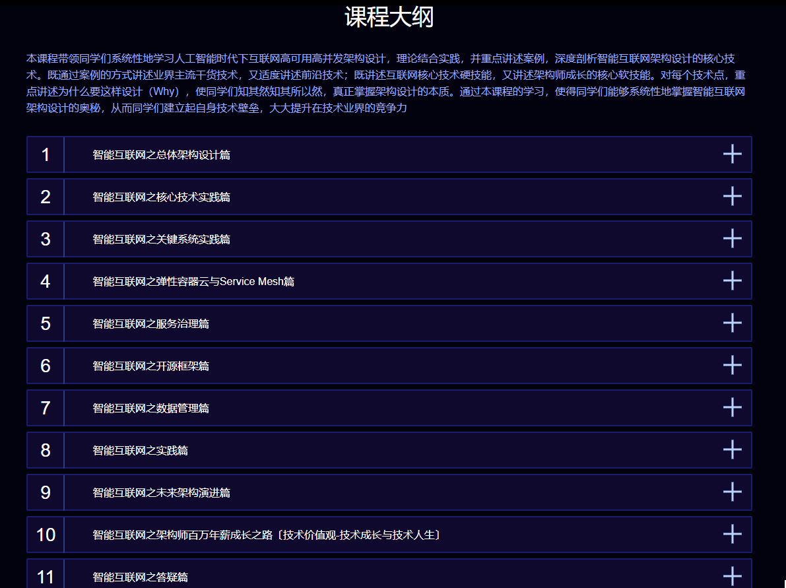

已经有**8756**个初学者都下载了！🔥

***

海量课程提供，2020版本课程全新升级，从0基础到高薪就业，不需脱产学习，冲击互联网高薪岗位
无论你是未就业的学生还是想转行的在职人员，不需要基础，只要你有梦想，想高薪！**完整的教程**，几乎涵盖了Java后端必备的知识点。  
关注小水怪的微信公众号，及时获取最新教程。

***

###  :lollipop: 项目系列

- [开课吧百万年薪架构师成长之路(关键字：001)](https://pan.baidu.com/s/1XyLWsyyI3bAY3wqdgptztA)
- [2020慕课网零基础造就Java工程师(关键字：002)](https://pan.baidu.com/s/1yyC4EpZHpyw3rPxWW0VtPA)
- [图灵Java课程第三期(关键字：003)](https://pan.baidu.com/s/1hyfRnQRvtPsmTZ8pVAfrVA)
- [享学2期(关键字：004)](https://pan.baidu.com/s/1_wbxDINLu-kdKSqasmj6RA)
- [黑马程序员_30天轻松掌握JavaWeb视频(关键字：005)](https://pan.baidu.com/s/1QbeRXJouwZCKeTrXkzR-5Q)

  

#### :sparkling_heart:<a name="公众号">加入公众号</a> ###

点击项目，跳转云盘链接。
需要的小伙伴，请关注微信公众号:小水怪的Android世界, 或者扫描下方公众号二维码，回复关键字,即可免费获取提取码。海量学习资源，持续更新中~。
***

***
## 课程大纲及学习周期安排 (详细版)

